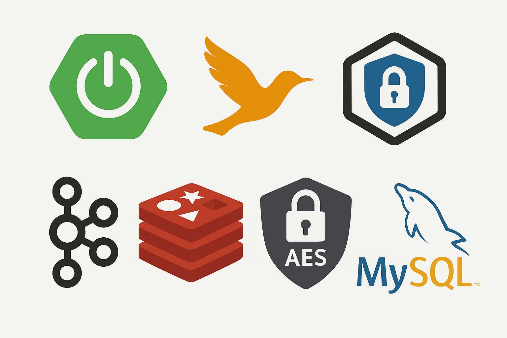
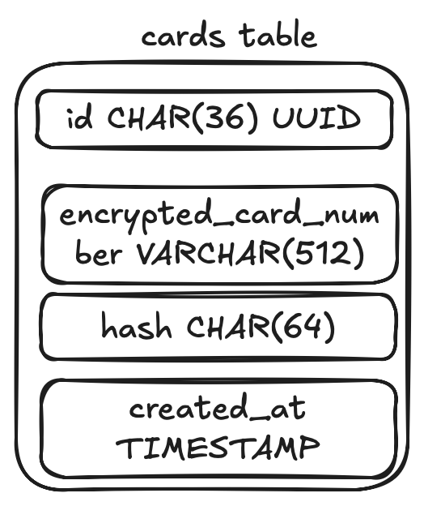
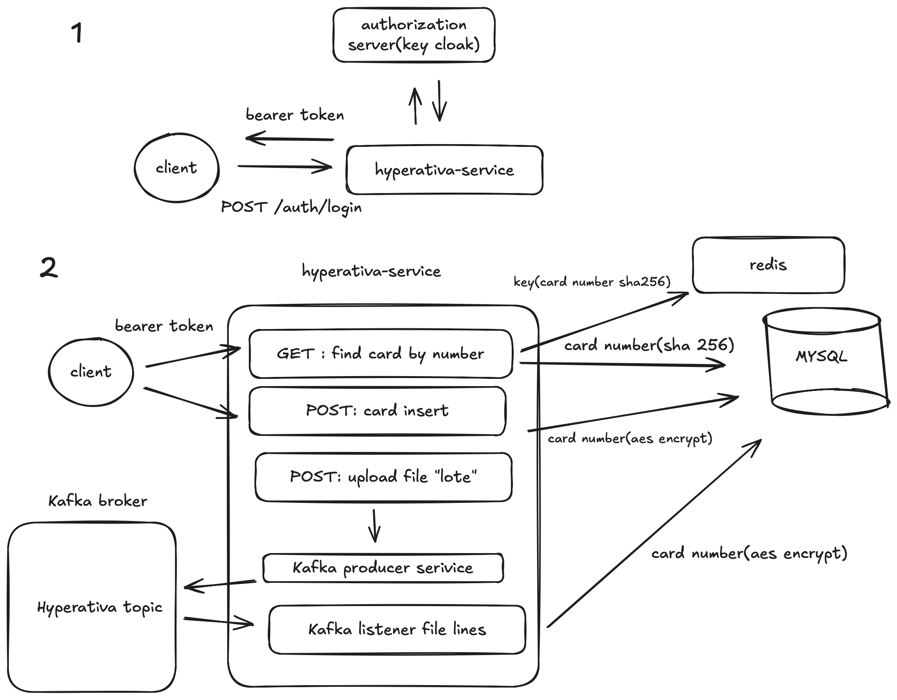

# Hyperativa Challenge API

This project implements an API for registering, querying, and processing card numbers using modern Spring Boot patterns and an event-driven architecture.



---
##  Features

### Authentication (Keycloak + Internal Login Endpoint)
- Keycloak runs via Docker.
- The application exposes `/auth/login` so users can obtain an Oauth2 token directly through Swagger using:
```json
{
  "username": "user",
  "password": "password"
}
```
### Flyaway Database Migration

This project uses Flyway to manage database migrations for the cards MySQL database. Flyway allows you to version, track, and automatically apply database schema changes in a controlled manner.

### AES Encryption
- Card numbers are encrypted at rest using AES (`AES_KEY` environment variable).
- The hash is used to retrieve the card number more easily
### Redis Cache
- Card lookups are cached using Redis to improve performance.

###  Kafka File Processing
- File uploads send each card number to Kafka.
- A Kafka consumer processes the events asynchronously and persists the encrypted values.

### Database


| Column Name | Type | Description |
|------|----------|-------------|
| id | `VARCHAR` | Unique identifier for the card. A UUID is used to guarantee uniqueness across distributed systems. |
| card_number_encrypted | `VARCHAR` | Stores the AES‑encrypted full card number. This ensures sensitive data is never persisted in plain text. |
| hash | `VARCHAR` | A hash (typically SHA‑256) of the card number. The hash is used to quickly and securely search for the card number, without exposing the original value. |
| created_at | `TIMESTAMP` | Timestamp indicating when the card was inserted into the system. Useful for auditing and history tracking. |

###  API Contracts
Main endpoints:

| Method | Endpoint | Description |
|--------|----------|-------------|
| POST | `/auth/login` | Generates JWT to access protected endpoints |
| POST | `/api/v1/cards` | Inserts a single card |
| GET | `/api/v1/cards/{cardNumber}` | Retrieves card information |
| POST | `/api/v1/cards/upload` | Uploads `.txt` file containing card batch |

File format rules:
- Skip header lines starting with `DESAFIO-HYPERATIVA`
- Skip footer lines starting with `LOTE`
- Only lines starting with `C` contain card data

---

### Top Level Design

## How to Run

### 1. Start all services:

```bash
docker-compose build
```

```bash
docker-compose up -d
```

This starts:
- MySQL
- Redis
- Kafka + Zookeeper
- Keycloak (preloaded realm + user)
- The Spring Boot API

### 2. Verify containers:
```bash
docker ps
```

### 3. Stop services:
```bash
docker-compose down
```

---

##  Swagger UI

Once everything is running, open:

 **http://localhost:8080/swagger-ui.html**

### Getting a Token in Swagger

Go to:
```
/auth/login
```

Request Body:
```json
{
  "username": "user",
  "password": "password"
}
```

Copy the `access_token`, click **Authorize**, and paste:

```
Bearer <token>
```

Now you can use all protected routes.

---

##  Project Structure
```
src/
 └── main/
     ├── controller/        → REST endpoints
     ├── service/           → Business logic
     ├── kafka/             → Producers & consumers
     ├── config/            → Security, Kafka, Redis
     └── model/             → DTOs + Entities
```

---

##  Tests
- Controllers tested using MockMvc.
- Services tested with JUnit + Mockito.

---

## Common Issues

Here are some common problems you might encounter when running the project. You may need to:


```bash
docker-compose down
```

```bash
docker-compose up 
```